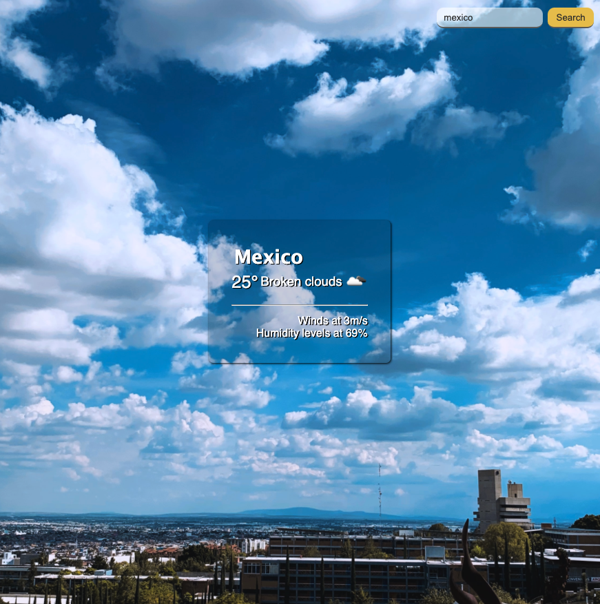

# :cloud: Weather App 

## Create a weather application to get the temperature and weather condition using a free API. 

## Illustration

## Language
- html5
- css3
- javascript vanilla

## Goals 
- Fundamentals (Javascript)
- DOM & interface
- Using API

## Status
Project completed

## Context
Project carried out during my training as a web developer